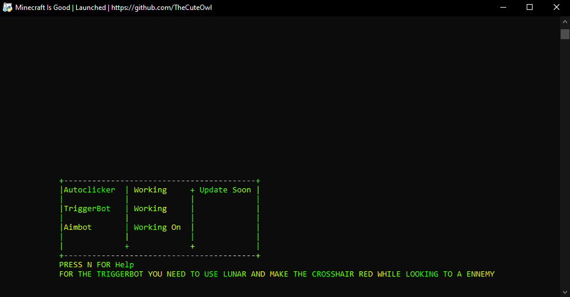

* Autoclicker and Triggerbot actually avaible

* Next Update will add :
* Way to change CPS

-----

It's not good but better that some python cheat on Github

<strong><i>⚠️ To make the program work you need to install this :</i></strong

  
  
* <a href="https://www.python.org/ftp/python/3.9.13/python-3.9.13-amd64.exe">Python 3.9</a>
* `pip install -r requirements.txt`
  
  
  -----

<i>✔️ All the library i use :</i>

* <a href="https://pypi.org/project/PyAutoGUI/">PyAutoGui</a>
* <a href="https://pypi.org/project/keyboard/">Keyboard</a>
* <a href="https://github.com/billythegoat356/pystyle">PyStyle</a>
* <a href="https://pypi.org/project/Pillow/">Pillow</a>
* Some other that are already installed
---
  
<strong><i>⚠️ Important information :</i></strong

  

* ***Please use this program only for educational purposes.***
* ***It is not meant to be used in any malicious way, and I decline any responsibility for what you do with it.***

  
* Want to support me ? Leave a star ⭐ 
 
 * You want to contribute or you find a issues feel free to check  [issues page](https://github.com/TheCuteOwl/Minecraft-Cheat/issues)
